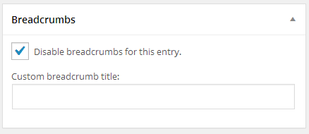

# Genesis Single Breadcrumbs

WordPress plugin that adds per-entry options for breadcrumbs when a Genesis child theme is active.

## Description

Adds a new metabox on the Add / Edit Post / Page / _Custom Post Type_ (anything that's public) screen with options for setting a custom breadcrumb title for that entry, or disabling breadcrumbs altogether on that entry.

It supports amending and disabling Genesis breadcrumbs that have been moved from the default hook of `genesis_before_loop`.

## Screenshots

  
_Per-entry breadcrumb options._

## Requirements
 * WordPress 3.6
 * Genesis 2.0

## Installation

### Upload

1. Download the latest tagged archive (choose the "zip" option).
2. Go to the __Plugins -> Add New__ screen and click the __Upload__ tab.
3. Upload the zipped archive directly.
4. Go to the Plugins screen and click __Activate__.

### Manual

1. Download the latest tagged archive (choose the "zip" option).
2. Unzip the archive.
3. Copy the folder to your `/wp-content/plugins/` directory.
4. Go to the Plugins screen and click __Activate__.

Check out the Codex for more information about [installing plugins manually](http://codex.wordpress.org/Managing_Plugins#Manual_Plugin_Installation).

### Git

Using git, browse to your `/wp-content/plugins/` directory and clone this repository:

`git clone git@github.com:GaryJones/genesis-single-breadcrumbs.git`

Then go to your Plugins screen and click __Activate__.

## Updates

This plugin supports the [GitHub Updater](https://github.com/afragen/github-updater) plugin, so if you install that, this plugin becomes automatically updateable direct from GitHub.

## Usage

On the Edit Post screen, you should see a new Breadcrumbs metabox. If not, select Screen Options at the top of the screen to reveal a list of checkboxes; ensure that Breadcrumbs is selected.

The breadcrumb title field accepts plain text (markup is stripped out). If left blank, then the entry title will be used as the default breadcrumb.

## Credits

Built by [Gary Jones](https://twitter.com/GaryJ)  
Copyright 2013 [Gamajo Tech](http://gamajo.com/)
